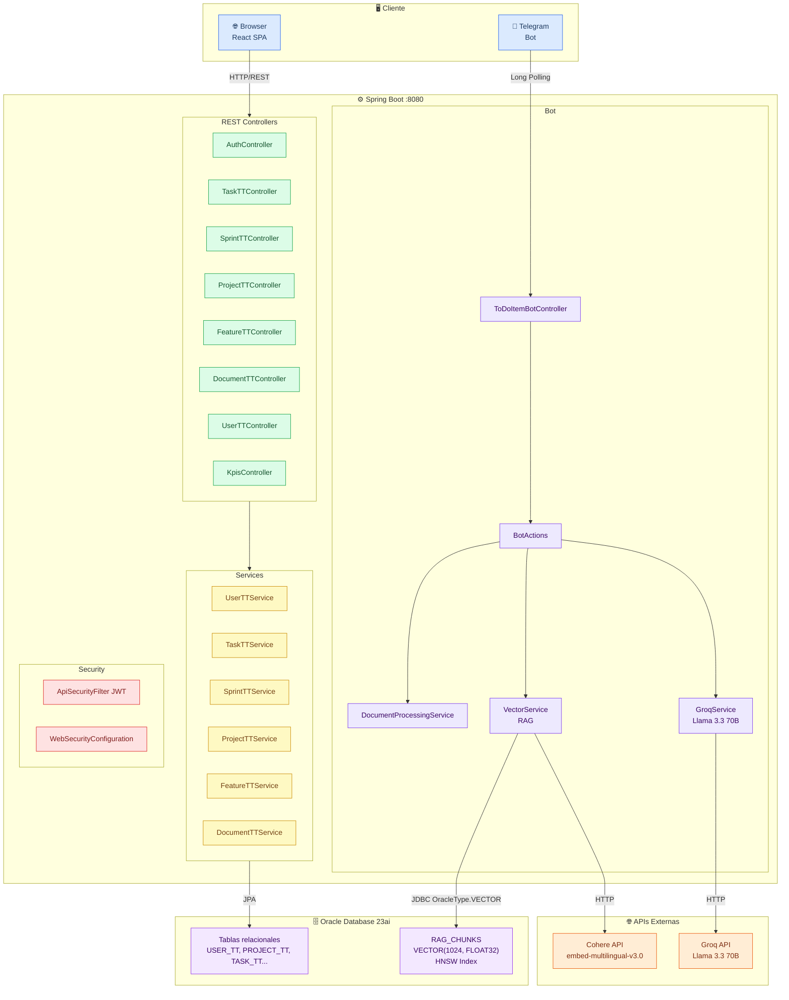

# Componentes

## Arquitectura General

## Componentes del Bot

| Clase | Responsabilidad |
|---|---|
| `ToDoItemBotController` | Recibe updates de Telegram, despacha por chat, maneja documentos |
| `BotActions` | Lógica de conversación — 25 handlers (`fnStart`, `fnAddItem`, `fnAsk`, etc.) |
| `BotConversationState` | 45 estados de conversación (máquina de estados por chat) |
| `GroqService` | Cliente HTTP a Groq API (Llama 3.3 70B), sanitización anti-injection, expansión de queries |
| `VectorService` | RAG vectorial: chunking semántico, Cohere embeddings, Oracle VECTOR insert/search, re-ranking híbrido |
| `DocumentProcessingService` | Descarga archivos de Telegram, extrae texto (PDFBox/POI), delega indexado a VectorService |
| `ClaudeService` | Cliente Claude API (opcional, activable con `claude.enabled=true`) |

## Componentes del Frontend

| Página / Ruta | Descripción |
|---|---|
| `/login`, `/signup` | Autenticación y registro |
| `/home` | Selector de proyectos |
| `/tasks` | Vista de tareas del usuario |
| `/projects` | Gestión de proyectos |
| `/projects/:id/team` | Gestión de equipo |
| `/projects/:id/statistics` | Estadísticas y KPIs con gráficas |
| `/projects/:id/sprints/:sprintId` | Detalle de sprint |
| `/archive` | Proyectos archivados |
| `/profile` | Perfil de usuario |
