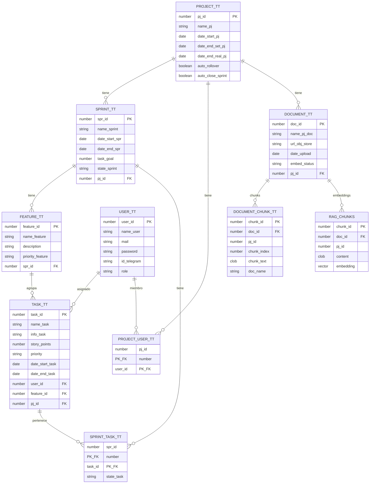

# Base de Datos

**Motor:** Oracle Database 23ai (Autonomous Database)  
**Conexión:** mTLS con Oracle Wallet  
**DDL Auto:** `spring.jpa.hibernate.ddl-auto=update`

## Diagrama de Tablas

## Tablas Principales

| Tabla | Descripción |
|---|---|
| `USER_TT` | Usuarios del sistema con rol y vinculación a Telegram |
| `PROJECT_TT` | Proyectos con fechas y configuración de auto-gestión |
| `SPRINT_TT` | Sprints con estado y meta de story points |
| `TASK_TT` | Tareas con estimaciones, prioridad y fechas reales |
| `FEATURE_TT` | Agrupaciones de tareas por funcionalidad |
| `SPRINT_TASK_TT` | Relación muchos a muchos entre sprints y tareas |
| `PROJECT_USER_TT` | Membresía de usuarios en proyectos |
| `DOCUMENT_TT` | Metadatos de documentos subidos para RAG |
| `DOCUMENT_CHUNK_TT` | Chunks de texto extraídos de documentos (legacy, pre-vector) |
| `RAG_CHUNKS` | Chunks semánticos con embeddings `VECTOR(1024, FLOAT32)` para búsqueda vectorial |
