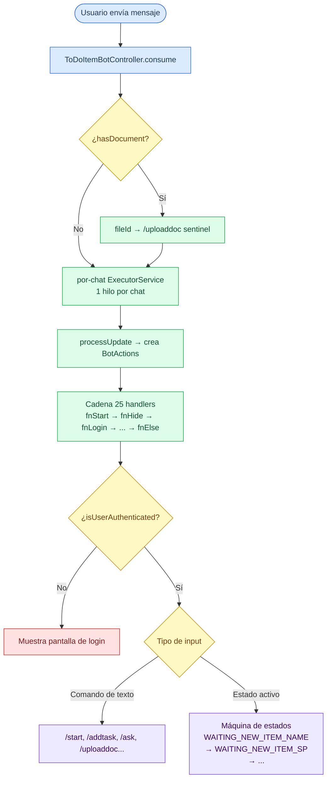

# Flujo del Bot de Telegram

## Concurrencia por chat

Cada chat tiene su propio `ExecutorService` de 1 hilo. Garantiza que los mensajes del mismo usuario se procesen en orden sin race conditions, sin locks explícitos.

## Máquina de estados

`BotConversationState` define ~45 estados en un `ConcurrentHashMap<Long, BotConversationState>` indexado por `chatId`:

