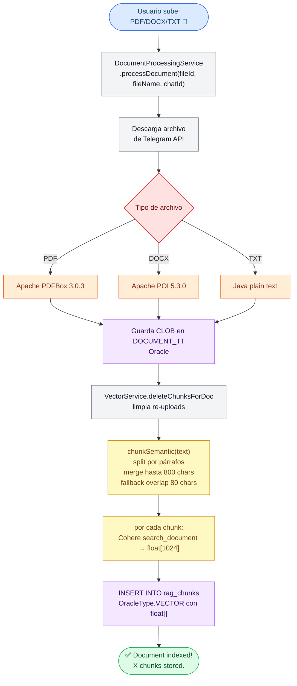

# Flujo de Indexación de Documentos

## Formatos soportados

| Formato | Extractor |
|---|---|
| PDF | Apache PDFBox 3.0.3 |
| DOCX | Apache POI 5.3.0 |
| TXT | Java plain text |

## Re-upload

Al subir documento ya existente, `deleteChunksForDoc(docId)` elimina chunks anteriores antes de indexar — evita duplicados en búsqueda vectorial.
