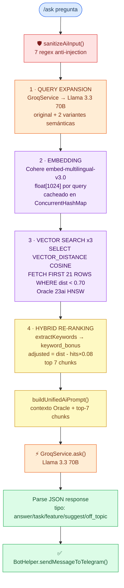

# Flujo RAG — Comando /ask

```mermaid
flowchart TD
    Ask(["/ask pregunta"]) --> Sanitize["🛡️ sanitizeAiInput()\n7 regex anti-injection"]
    Sanitize --> Expand["1 · QUERY EXPANSION\nGroqService → Llama 3.3 70B\noriginal + 2 variantes semánticas"]
    Expand --> Embed["2 · EMBEDDING\nCohere embed-multilingual-v3.0\nfloat[1024] por query\ncacheado en ConcurrentHashMap"]
    Embed --> VSearch["3 · VECTOR SEARCH x3\nSELECT VECTOR_DISTANCE COSINE\nFETCH FIRST 21 ROWS WHERE dist &lt; 0.70\nOracle 23ai HNSW"]
    VSearch --> Rerank["4 · HYBRID RE-RANKING\nextractKeywords → keyword_bonus\nadjusted = dist - hits×0.08\ntop 7 chunks"]
    Rerank --> Prompt["buildUnifiedAiPrompt()\ncontexto Oracle + top-7 chunks"]
    Prompt --> LLM["⚡ GroqService.ask()\nLlama 3.3 70B"]
    LLM --> Parse["Parse JSON response\ntipo: answer/task/feature/suggest/off_topic"]
    Parse --> Send["✅ BotHelper.sendMessageToTelegram()"]

    classDef trigger fill:#DBEAFE,stroke:#2563EB,color:#1E3A5F
    classDef security fill:#FEE2E2,stroke:#DC2626,color:#7F1D1D
    classDef ai fill:#FFEDD5,stroke:#EA580C,color:#7C2D12
    classDef vector fill:#F3E8FF,stroke:#9333EA,color:#3B0764
    classDef rerank fill:#FEF9C3,stroke:#CA8A04,color:#713F12
    classDef done fill:#DCFCE7,stroke:#16A34A,color:#14532D

    class Ask trigger
    class Sanitize security
    class Expand,LLM ai
    class Embed,VSearch vector
    class Rerank,Prompt rerank
    class Parse,Send done
```

Ver [decisiones de diseño del pipeline RAG](/docs/rag/overview) para el razonamiento detrás de cada etapa.
