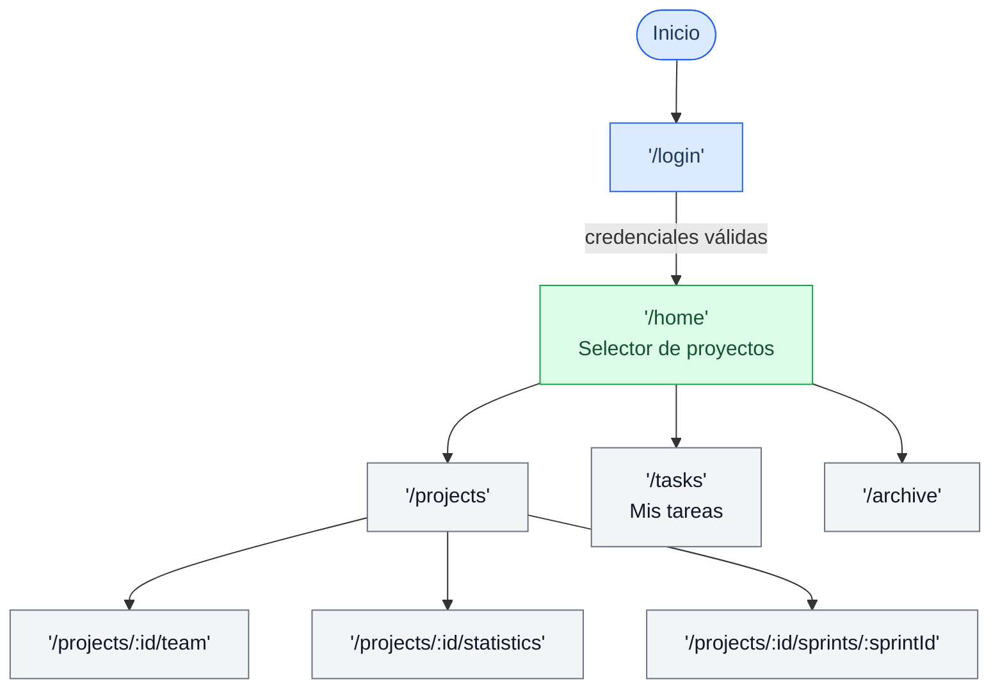

# Flujo Web

## Rutas

| Ruta | Descripción |
|---|---|
| `/login` | Autenticación |
| `/signup` | Registro |
| `/home` | Selector de proyectos |
| `/tasks` | Tareas del usuario activo |
| `/projects` | Lista de proyectos |
| `/projects/:id/team` | Gestión de equipo |
| `/projects/:id/statistics` | KPIs y gráficas |
| `/projects/:id/sprints/:sprintId` | Detalle de sprint |
| `/archive` | Proyectos archivados |
| `/profile` | Perfil de usuario |
