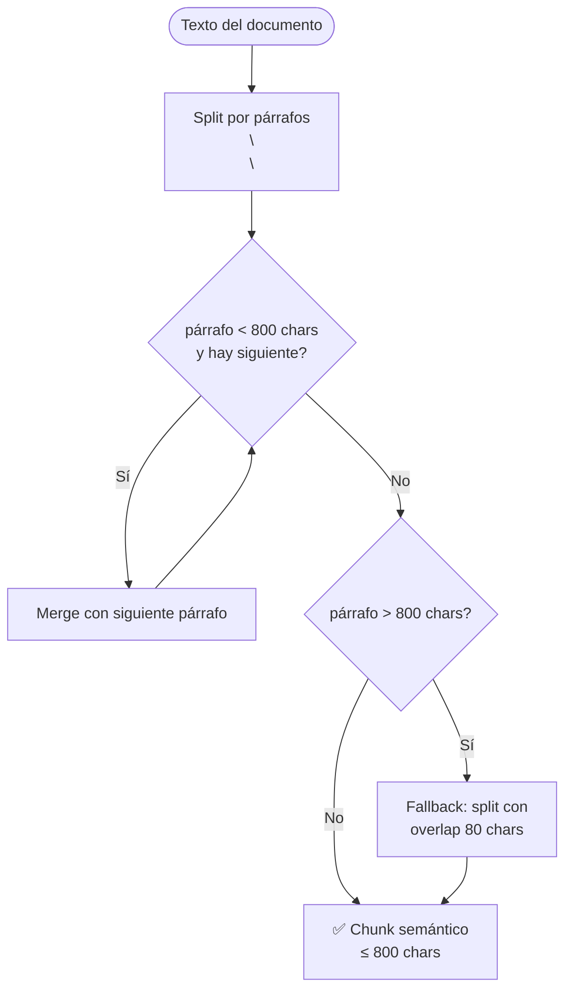

# Chunking — Semántico vs. Fijo

## Problema con chunking fijo

**Anterior:** cortar cada 500 caracteres con 50 de overlap.

**Problema:** un chunk podía empezar a mitad de oración o partir una lista numerada en dos chunks sin contexto.

## Solución actual

Split por párrafos (`\n\n`) + merge hasta 800 chars + fallback con overlap para párrafos gigantes.

Cada chunk semántico es una unidad coherente — mejora tanto la calidad del embedding como la legibilidad en el prompt del LLM.
