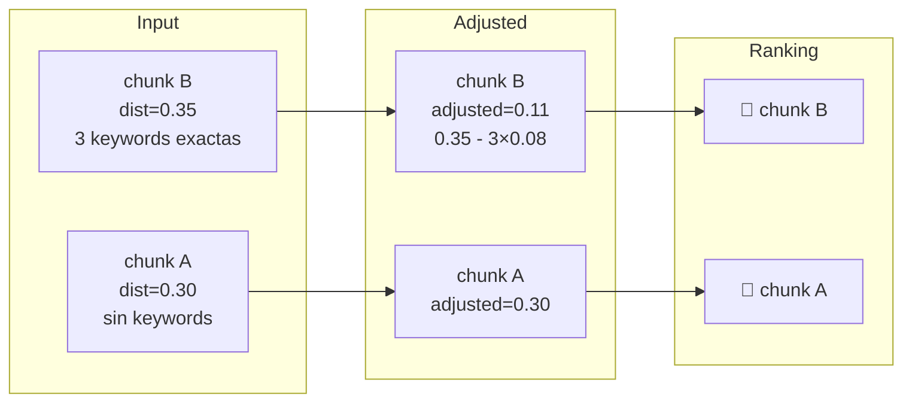

# Hybrid Re-ranking — Keyword Bonus

Vector search es bueno para semántica, malo para términos exactos (nombres propios, IDs, fechas exactas). El keyword bonus **reduce artificialmente la distancia coseno** de chunks que contienen las palabras clave exactas de la query.

## Fórmula

```
adjusted_score = vector_distance - keyword_bonus
keyword_bonus  = keyword_hits * 0.08
MAX_BONUS      = 0.30
```

## Ejemplo



`MAX_KEYWORD_BONUS = 0.30` evita que un chunk con muchas keywords triviales supere a uno vectorialmente muy relevante.

## Extracción de keywords

`extractKeywords(query)` filtra stopwords en español e inglés antes de calcular hits — palabras como *"el"*, *"de"*, *"the"* no cuentan como hits.
